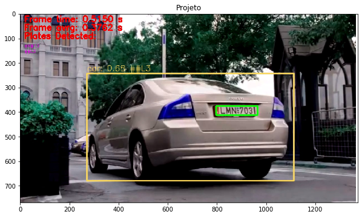
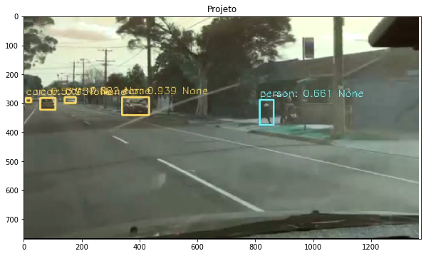

# Ciência da Computação

## Visão Computacional e Processamento de Imagens
### Prof. Francisco Zampirolli - 2019q3

***
Bruno Sanches Rodrigues

# Segmentação de Carros e Placas em Vídeos de Segurança
O projeto desenvolvido consiste em um sistema de identificação de carros em vídeos de seguraça. O sistema também realiza a segmentação das placas dos carros, bem como o reconhecimento dos caracteres.


```python
import cv2
import matplotlib.pyplot as plt
data = cv2.imread("data/rel01.jpg")
data.shape
plt.figure(figsize=(10,10)); plt.title("Projeto"); fig = plt.imshow(data,"gray")
data = cv2.imread("data/rel02.jpg")
data.shape
plt.figure(figsize=(10,10)); plt.title("Projeto"); fig = plt.imshow(data,"gray")
```








### Objetivos
 * Principal: Implementar um sistema de identificação e contagem de carros em vídeos (de câmera parada) de forma que possa ser útil para o estacionamento da faculdade.
 * Secundário: Realizar a segmentação e identificação das placas dos carros que entram e que saem.

### Base de dados
Imagens de câmeras de segurança de trânsito, estacionamentos, pedágios, etc.
Serão selecionados alguns vídeos com as seguintes características:
  * A posição da câmera é favorável ao reconhecimento de placas;
  * Há a passagem de carros nos dois sentidos da via;
  * Há gravações diurnas e noturnas.

Dessa forma, a base de dados seria uma simulação do problema do estacionamento na universidade.
O objetivo é que o sistema seja robusto o suficiente para funcionar em uma amostra de vídeos que apresentem algumas ou todas as condições acima.

### Ferramentas
* Manipulação do vídeo: OpenCV

* Segmentação dos carros: Yolov3

* Segmentação da Placa: OpenCV

* Classificação dos Caracteres: kNN

### Conclusão

Os objetivo foi atingidos parcialmente.
A segmentação dos carros foi feita com sucesso e com diferentes graus de precisão que variam de acordo com a qualidade do vídeo e a velocidade de processamento desejada.

O reconhecimento de placas foi implementado com uma precisão subótima, e o reconhecimento de caracteres também não mostrou resultados satisfatórios.

A contagem de carros não foi implementada.

Há diversas melhorias que podem ser implementadas em trabalhos futuros:
 * Treinamento do YOLOv3 em um conjunto de dados específico;
 * Utilização do YOLOv3 para segmentas as placas dos carros também;
 * Melhoria no desempenho do algoritmo como um todo;
 * Implementação do _tracking_ e da contagem dos carros;
 * Utilização de diferentes bases de dados para treinamento do classificador de caracteres.

### Referências Principais

YOLO object detection with OpenCV:

https://www.pyimagesearch.com/2018/11/12/yolo-object-detection-with-opencv/

OpenCV 3 License Plate Recognition Python:

https://github.com/MicrocontrollersAndMore/OpenCV_3_License_Plate_Recognition_Python


Video-based vehicle counting system built with Python/OpenCV:

https://alphacoder.xyz/vehicle-counting/

OCR of Hand-written Data using kNN:

https://docs.opencv.org/3.4.2/d8/d4b/tutorial_py_knn_opencv.html

Download youtube videos:

https://www.y2mate.info/downloads/

YOLO: Real-Time Object Detection:

https://pjreddie.com/darknet/yolo/
